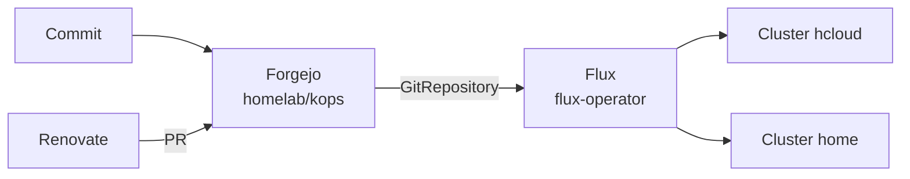

# Architecture

## GitOps flow

Each cluster has its own Flux instance that syncs its path `kubernetes/<cluster>/flux`.

## Docs pipeline

Why this combination: [ADR 0001](../decisions/0001-docs-zensical-garage.md).
