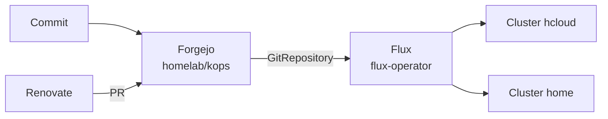

# Architektur

## GitOps-Fluss

Jeder Cluster hat eine eigene Flux-Instanz, die ihren Pfad `kubernetes/<cluster>/flux` synchronisiert.

## Doku-Pipeline

Warum diese Kombination: [ADR 0001](../decisions/0001-docs-zensical-garage.md).
