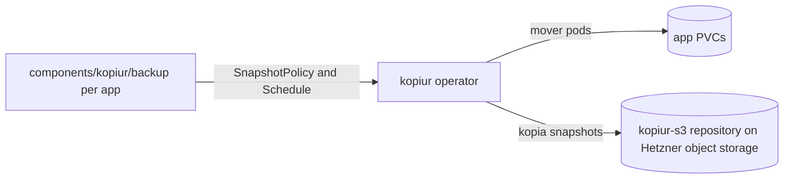

# kopiur

[Kopiur](https://github.com/home-operations/kopiur) is a Kopia-based backup operator. It snapshots application PVCs on a schedule into a shared repository on Hetzner object storage and restores them automatically (deploy-or-restore) when a PVC is recreated.

**Namespace:** `kopiur-system` · **Clusters:** `home`

## Architecture

Two Flux Kustomizations in `kopiur-system`: the operator HelmRelease (`kopiur`, with CRDs, ServiceMonitors, PrometheusRules and Grafana dashboards) and, depending on it, the repository definition (`kopiur-repository`). Apps opt in per-PVC through the reusable `components/kopiur/backup` kustomize component, which creates the PVC plus a `SnapshotPolicy`, an hourly `SnapshotSchedule` and a deploy-or-restore `Restore` for `${APP}`.



Snapshots are identified as `username@hostname:path` in Kopia; kopiur maps `username` to the SnapshotPolicy name and `hostname` to the namespace.

## Dependencies

| Dependency | Type | Purpose |
| --- | --- | --- |
| Hetzner object storage bucket `kopiur-backup` | S3 backend | Stores the encrypted Kopia repository |
| `kopiur-repository-secret` | Secret | S3 credentials and repository password |
| miroir storage (`miroir-local`, `miroir-snap`) | Storage | Mover cache volumes and volume snapshots |

## Access

No user-facing route; the operator is controlled through its CRDs (`SnapshotPolicy`, `SnapshotSchedule`, `Restore`, `ClusterRepository`). Metrics and dashboards are exposed to the observability stack.

## Deployment

Two Flux Kustomizations in [ks.yaml](https://code.offene.cloud/homelab/kops/src/branch/main/kubernetes/home/apps/kopiur-system/kopiur/ks.yaml):

- `kopiur` - the operator [HelmRelease](https://code.offene.cloud/homelab/kops/src/branch/main/kubernetes/home/apps/kopiur-system/kopiur/app/helmrelease.yaml) (`installCRDs: true`, `installScope: cluster`) with ServiceMonitors, PrometheusRules and Grafana-operator dashboards enabled. A `healthChecks` entry gates dependents on the HelmRelease being ready.
- `kopiur-repository` - `dependsOn: kopiur`, deploys the `kopiur-s3` [ClusterRepository](https://code.offene.cloud/homelab/kops/src/branch/main/kubernetes/home/apps/kopiur-system/kopiur/repository/clusterrepository.yaml).

## Configuration

### Repository

The `kopiur-s3` `ClusterRepository` is usable from all namespaces (`allowedNamespaces.all: true`) and points at the Hetzner object storage bucket `kopiur-backup`. Notable settings:

- `create.enabled: true` - the repository is initialized automatically if it doesn't exist.
- Maintenance: quick runs hourly (10m jitter), full runs daily at night (1h jitter); `epoch.minDuration: 1h` bounds index epochs.
- `scheduleDefaults.timezone: Europe/Berlin` - all cron schedules evaluate in local time.

### Backup component

Apps opt in by adding the component to their `ks.yaml` (see the [backup component](https://code.offene.cloud/homelab/kops/src/branch/main/kubernetes/home/components/kopiur/backup)):

```yaml
components:
  - ../../../../components/kopiur/backup
postBuild:
  substitute:
    APP: <app>
```

The component creates, for `${APP}`:

- a PVC named `${APP}` whose `dataSourceRef` points at a kopiur `Restore` - a fresh PVC is populated from the latest snapshot, or left empty when none exists (`onMissingSnapshot: Continue`),
- a `SnapshotPolicy` (retention: 3 latest / 24 hourly / 7 daily / 4 weekly; mover cache and UID/GID configurable) targeting `kopiur-s3`,
- an hourly `SnapshotSchedule` (`H * * * *`).

Tunables via `postBuild.substitute` (defaults in parentheses): `KOPIUR_CAPACITY` (5Gi), `KOPIUR_STORAGECLASS` (`miroir-local`), `KOPIUR_ACCESSMODES` (`ReadWriteOnce`), `KOPIUR_SNAPSHOTCLASS` (`miroir-snap`), `KOPIUR_PUID`/`KOPIUR_PGID` (1000).

## Secrets

The repository secret is distributed into every namespace via the `components/kopiur/secret` component referenced by each namespace `kustomization.yaml`.

| Secret | Source | Keys | Used for |
| --- | --- | --- | --- |
| `kopiur-repository-secret` | SOPS: [secrets.sops.yaml](https://code.offene.cloud/homelab/kops/src/branch/main/kubernetes/home/components/kopiur/secret/secrets.sops.yaml) | `AWS_ACCESS_KEY_ID`, `AWS_SECRET_ACCESS_KEY`, `KOPIA_PASSWORD` | S3 credentials for the bucket and the Kopia repository encryption password |

## Storage

The repository itself lives off-cluster in the S3 bucket. In-cluster, movers use ephemeral cache volumes on `miroir-local` and volume snapshots via the `miroir-snap` snapshot class.

## Troubleshooting

### Populator restores an empty volume after a namespace move

**Symptoms:** After moving an app to a different namespace, the automatic deploy-or-restore provisions an empty volume (`NoSnapshotContinue`).

**Cause:** Kopia stores every snapshot under the identity `username@hostname:path`. Kopiur sets `username` to the `SnapshotPolicy` name and `hostname` to the namespace by default. In the new namespace the populator looks under the new identity, finds nothing, and continues with an empty volume.

**Fix:** Run a [manual restore](#manual-restore-into-an-existing-pvc) with an explicit `source.identity` pointing at the old identity.

### Restore fails or the mover does not start

**Symptoms:** A `Restore` hangs or errors; `kubectl -n <namespace> describe restore <name>` shows the reason.

**Cause and fix:** The most common causes:

- **Snapshot not found:** `username`, `hostname` or `sourcePath` don't match the identity in the repository. Cross-check with `kopia snapshot list --all`.
- **Repository not found:** wrong name or wrong `kind` (`Repository` instead of `ClusterRepository` or the other way around).
- **Mover doesn't start:** the PVC is still held by a running pod, or the repository credentials are missing in the namespace.
- **App can't read its files:** the mover UID/GID don't match the app's `securityContext`.

### Useful commands

```bash
kubectl -n kopiur-system get pods
kubectl -n kopiur-system logs deploy/kopiur -f
flux -n kopiur-system reconcile helmrelease kopiur --with-source

# Per-app backup state
kubectl -n <namespace> get snapshotpolicy,snapshotschedule,restore
kubectl -n <namespace> describe restore <name>
```

## Manual restore into an existing PVC

This procedure restores a kopia snapshot directly into an existing PVC using a `Restore` with an explicit identity. Use it when the automatic populator finds no snapshot, typically after moving an app to a different namespace.

### Identify the snapshot

Before restoring, confirm that snapshots actually exist under the old identity. The output of `kopia snapshot list --all` against the repository should contain a line like this:

```text
<APP>@<OLD_NAMESPACE>:/pvc/<APP>
```

If the PVC had a different name back then, `sourcePath` in the manifest must point to the old name, not the new one.

### Manifest

Save the manifest as `restore-manual.yaml`.

```yaml
---
apiVersion: kopiur.home-operations.com/v1alpha1
kind: Restore
metadata:
  name: APP-manual
  namespace: NAMESPACE
spec:
  # Required for an identity source: there is no policy to infer the repository from.
  repository:
    kind: ClusterRepository
    name: kopiur-s3

  source:
    identity:
      # Kopia username: the name of the SnapshotPolicy that wrote the snapshots.
      username: APP
      # Kopia hostname: the OLD namespace the snapshots were written from.
      hostname: OLD_NAMESPACE
      # Kopia source path: PVC sources are recorded as /pvc/<pvcName>.
      sourcePath: /pvc/APP
      # Optional: pin an exact snapshot instead of restoring the latest one.
      # snapshotID: <id>

  target:
    pvcRef:
      # Existing PVC in this namespace. The app must be scaled to 0 before restoring.
      name: APP

  options:
    # Mirror the snapshot exactly: delete files in the target that are not in the snapshot.
    # Prevents stale SQLite -wal/-shm files from a fresh instance mixing with the restored DB.
    enableFileDeletion: true

  mover:
    # Own the restored files as the app's UID/GID (default mover UID is 65532).
    securityContext:
      runAsUser: 1000
      runAsGroup: 1000
    # Make the volume group-writable for the app's group.
    podSecurityContext:
      fsGroup: 1000

  policy:
    # Fail loudly instead of silently leaving the volume empty.
    onMissingSnapshot: Fail
```

### Stop the app

Suspend the HelmRelease first, otherwise Flux scales the Deployment back up on the next reconcile.

```bash
flux -n NAMESPACE suspend hr APP
kubectl -n NAMESPACE scale deploy/APP --replicas=0
```

Wait until no pod of the app is running anymore:

```bash
kubectl -n NAMESPACE get pods
```

As long as the app is writing to its database, even mirror mode won't help, so only continue once the pod is gone.

### Apply the manifest and watch the restore

```bash
kubectl apply -f restore-manual.yaml

kubectl -n NAMESPACE get restore APP-manual -w
```

The phases go `Resolving`, then `Restoring`, then `Completed`.

### Start the app again

```bash
flux -n NAMESPACE resume hr APP
```

Check the contents (adjust the container name):

```bash
kubectl -n NAMESPACE exec deploy/APP -c <container> -- ls -la /config
```

### Clean up

A restore with `pvcRef` is one-shot and finished once it reaches `Completed`. The object can be deleted; the data stays in the PVC.

```bash
kubectl -n NAMESPACE delete restore APP-manual
```

Don't commit the manifest to Git, otherwise Flux would recreate it on every reconcile.

### Behavior with existing data

Without `enableFileDeletion`, a restore is additive: files from the snapshot overwrite files with the same name in the PVC, and all other files are left in place. For SQLite-based apps (Sonarr, Radarr, Prowlarr) this is risky, because leftover `-wal`/`-shm` files from a fresh instance can corrupt the restored database.

With `enableFileDeletion: true`, the **entire PVC** becomes an exact mirror of the snapshot. Anything created after the backup is gone afterwards.

### Cautious variant restore into a new PVC first

To inspect the contents before overwriting anything, replace the `target` block with a new PVC and drop the `options` block:

```yaml
  target:
    pvc:
      # New PVC created by the operator next to the original one.
      name: APP-restored
      # Required: must be at least as large as the backed-up data.
      capacity: 20Gi
```

Once you have checked it, delete the test PVC and run the actual restore with `pvcRef`. The PVC created by Kopiur is not owned by the `Restore` and survives deleting the restore, so it has to be removed separately.

### After the restore

By default, new backups from the new namespace are written under `<APP>@<NAMESPACE>` as a new history. The old snapshots under `<APP>@<OLD_NAMESPACE>` remain in the repository.

To continue the old history instead, set `spec.identity` in the `SnapshotPolicy` to `username: <APP>` and `hostname: <OLD_NAMESPACE>`. In that case, no policy in the old namespace may still back up under the same identity, otherwise the snapshot history gets corrupted.

Don't rely on the backups until the first successful backup run in the new namespace has completed.

## Decisions

Newest first.

### 2026-06-09 Replace volsync with kopiur

**Status:** Accepted

**Context:** PVC backups in the `home` cluster ran on volsync (latterly its Kopia fork). Kopiur is a purpose-built Kopia operator from the home-operations community with a simpler CRD model (policies, schedules and a deploy-or-restore populator) and first-class monitoring.

**Decision:** Deploy kopiur with a cluster-wide S3 repository on Hetzner object storage and migrate apps to the reusable `components/kopiur/backup` component; drop the volsync component in `home`.

**Consequences:** Apps opt in with one component reference plus `APP` substitution and get backup, retention and automatic restore uniformly. Restores across namespace moves need the manual identity-based procedure (see [manual restore](#manual-restore-into-an-existing-pvc)). The `hcloud` cluster still has a volsync component. <!-- TODO: document the hcloud backup strategy -->

## References

- Manifests (home): [kubernetes/home/apps/kopiur-system/kopiur](https://code.offene.cloud/homelab/kops/src/branch/main/kubernetes/home/apps/kopiur-system/kopiur)
- Backup component: [kubernetes/home/components/kopiur](https://code.offene.cloud/homelab/kops/src/branch/main/kubernetes/home/components/kopiur)
- Upstream documentation: [kopiur](https://github.com/home-operations/kopiur) · [Kopia](https://kopia.io/docs/)
