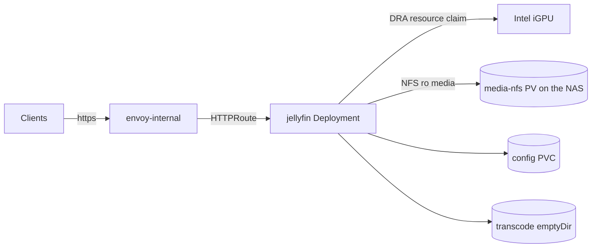

# jellyfin

[Jellyfin](https://jellyfin.org/) is the media server for movies, series and music. It streams the library on the NAS to browsers, TVs and mobile apps, transcoding in hardware on the node's Intel iGPU when needed.

**Namespace:** `media` · **Clusters:** `home`

## Architecture

A single Deployment (app-template chart, official Jellyfin image, which ships `jellyfin-ffmpeg`, the Intel drivers and the OpenCL runtime). The pod requests the integrated GPU through a Kubernetes DRA `ResourceClaimTemplate` (`deviceClassName: gpu.intel.com`) instead of privileged hostPath mounts.



## Dependencies

| Dependency | Type | Purpose |
| --- | --- | --- |
| intel-gpu-resource-driver (`kube-system`) | DRA driver | Provides the `gpu.intel.com` device class; `ks.yaml` `dependsOn` it |
| media-nfs (`media` namespace) | Storage | Shared 60Ti NFS volume with the media library |
| kopiur backup component | Backup | Hourly snapshots of the config PVC |

## Access

LAN-only at `jellyfin.${INTERNAL_DOMAIN}` via the `envoy-internal` Gateway. Authentication is Jellyfin's own user accounts.

## Deployment

[ks.yaml](https://code.offene.cloud/homelab/kops/src/branch/main/kubernetes/home/apps/media/jellyfin/ks.yaml) `dependsOn` the `intel-gpu-resource-driver` Kustomization and pulls in the `kopiur/backup` component for the config PVC. The [HelmRelease](https://code.offene.cloud/homelab/kops/src/branch/main/kubernetes/home/apps/media/jellyfin/app/helmrelease.yaml) requests the GPU via a pod `resourceClaim` backed by [resourceclaimtemplate.yaml](https://code.offene.cloud/homelab/kops/src/branch/main/kubernetes/home/apps/media/jellyfin/app/resourceclaimtemplate.yaml) (`deviceClassName: gpu.intel.com`), so the container gets the render device without running privileged.

## Configuration

- `JELLYFIN_PublishedServerUrl: https://jellyfin.${INTERNAL_DOMAIN}` - the URL Jellyfin advertises to clients.
- Custom HTTP probes against `/health` on port 8096; `strategy: Recreate` because the config volume is `ReadWriteOnce`.
- The pod runs as non-root UID/GID 2000 with a read-only root filesystem; writable paths (`/cache`, `/config/log`, `/tmp`) are emptyDir subPath mounts.

The in-app transcoding settings are documented in [Transcoding settings](#transcoding-settings).

## Secrets

Jellyfin has no Kubernetes secrets; users and API keys live in its own database on the config PVC. The ntfy webhook token (see [plugins](#webhook-to-ntfy)) is configured inside the Jellyfin UI only.

## Storage

| Volume | Claim | Content |
| --- | --- | --- |
| `/config` | `jellyfin` (kopiur-managed, backed up hourly) | Database, settings, metadata |
| `/media` | `media-nfs` (shared RWX NFS claim) | Media library on the NAS |
| `/transcode` | emptyDir | Transcode segments, disposable |
| `/cache`, `/config/log`, `/tmp` | emptyDir (subPaths) | Cache and logs, disposable |

## Transcoding settings

Configured under **Dashboard → Playback → Transcoding**; the order matches the UI. The media engine of the Arrow Lake-H iGPU (Intel Core Ultra 5 225H) decodes **and** encodes H.264, HEVC (8/10-bit), VP9 and AV1 in hardware; multiple simultaneous 4K HDR transcodes are no problem. Verification commands live in [troubleshooting](#troubleshooting).

Reference: [Jellyfin Docs - Intel GPU](https://jellyfin.org/docs/general/post-install/transcoding/hardware-acceleration/intel) · [Jellyfin Docs - Stereo Downmix](https://jellyfin.org/docs/general/post-install/transcoding/downmix)

### Hardware acceleration

```text
Hardware acceleration: Intel Quicksync (QSV)
QSV Device:            /dev/dri/renderD128
```

- **Intel Quicksync (QSV):** The preferred method on Linux for current Intel GPUs. VA-API is only needed for very old hardware.
- **QSV Device:** The iGPU's render node, provided by the DRA claim.

### Hardware decoding

```text
Enable hardware decoding for:
[x] H264
[x] HEVC
[x] MPEG2
[ ] VC1
[x] VP8
[x] VP9
[x] AV1
[x] HEVC 10bit
[x] VP9 10bit
[x] HEVC RExt 8/10bit
[x] HEVC RExt 12bit

[x] Prefer OS native DXVA or VA-API hardware decoders
```

- Everything reported by `vainfo` with `VAEntrypointVLD` is enabled. The iGPU even decodes HEVC 4:2:2 and 4:4:4 up to 12-bit (RExt).
- **VC1** is disabled because the hardware doesn't support it (it doesn't appear in `vainfo`). Such files, usually old Blu-ray rips, are decoded by the CPU.
- **Prefer OS native decoders:** Uses the VA-API decoders instead of the QSV decoders. Required for Dolby Vision support.

### Hardware encoding

```text
[x] Enable hardware encoding
[x] Enable Intel Low-Power H.264 hardware encoder
[x] Enable Intel Low-Power HEVC hardware encoder
```

- **Enable hardware encoding:** Encoding runs on the iGPU instead of the CPU.
- **Low-Power encoders:** Must stay enabled on Arrow Lake, since Meteor Lake / Arrow Lake and newer only support the Low-Power encoding mode. The required HuC firmware is loaded automatically from Gen 12 (Alder Lake) onwards, no kernel parameters needed. Verify on the node with `sudo dmesg | grep -i huc`.

### Encoding formats

```text
[x] Allow encoding in HEVC format
[x] Allow encoding in AV1 format
```

- H.264 is always enabled. HEVC and AV1 are additionally allowed because the iGPU can encode both in hardware.
- Jellyfin only uses these formats if the client supports them. They save significant bandwidth at the same quality, which mainly helps with remote streaming.

### VPP tone mapping

```text
[ ] Enable VPP Tone mapping
VPP Tone mapping brightness gain: 16
VPP Tone mapping contrast gain:   1
```

- Disabled. VPP tone mapping is slightly more power-efficient, but offers very few tuning options and doesn't support Dolby Vision. If enabled, it would take priority over OpenCL.
- The gain values are defaults and have no effect while VPP is disabled.

### Tone mapping with OpenCL

```text
[x] Enable Tone mapping
Tone mapping algorithm: BT.2390
Tone mapping mode:      Auto
Tone mapping range:     Auto
Tone mapping desat:     0
Tone mapping peak:      100
Tone mapping param:     (empty)
```

- **Enable Tone mapping:** Converts HDR10, HLG and Dolby Vision to SDR when the client can't display HDR. Without tone mapping, HDR content looks washed out and grey on SDR devices. Runs via OpenCL on the iGPU.
- **Algorithm BT.2390:** The recommended default.
- **Mode Auto:** Switch to `RGB` if highlights look blown out.
- **Range Auto:** The output color range matches the source.
- **Desat 0, Peak 100, Param empty:** Defaults. Leave them unchanged as long as the picture looks good.

### General and paths

```text
Transcoding thread count:  Auto
FFmpeg path:               /usr/lib/jellyfin-ffmpeg/ffmpeg
Transcode path:            /transcode
Fallback font folder path: (empty)
[ ] Enable fallback fonts
```

- **Thread count Auto:** Mainly affects software transcoding. CPU load is low anyway with hardware transcoding.
- **FFmpeg path:** The bundled `jellyfin-ffmpeg` from the official image.
- **Transcode path `/transcode`:** Dedicated emptyDir volume for transcode segments, since files are constantly written and deleted here.
- **Fallback fonts:** Only needed if subtitles with missing fonts render incorrectly.

### Audio

```text
[ ] Enable VBR audio encoding
Audio boost when downmixing: 1.5
Stereo Downmix Algorithm:    AC-4
Audio seek strategy:         TrimCopiedAudio
Max muxing queue size:       2048
```

- **VBR audio encoding:** Disabled, since variable bitrate can occasionally cause buffering or compatibility issues.
- **Stereo Downmix Algorithm AC-4:** An industry standard that preserves both volume level and spatial impression well. The most balanced algorithm for movies.
- **Audio boost 1.5:** The default of 2 is tuned for ffmpeg's built-in downmix (`None`). With AC-4, 1.5 is a good middle ground. If loud scenes sound distorted, lower it to 1.2-1.3. If everything is too quiet, raise it towards 2.
- **Seek strategy and muxing queue:** Defaults. Only increase the queue if `Too many packets buffered for output stream` appears in the FFmpeg log.

!!! note "When does the downmix apply?"
    Only when the **server** transcodes the audio to stereo, i.e. when the client reports that it only supports stereo (typically browsers and some TV apps). With Direct Play or Direct Stream of multichannel audio, the playback device downmixes on its own and this setting has no effect. The playback info shows whether the server is downmixing: the audio stream is then listed as "Transcoding" with 2 channels. Changes only apply to newly started playback sessions.

### Software encoding and deinterlacing

```text
Encoding preset:      Auto
H.265 encoding CRF:   28
H.264 encoding CRF:   23
Deinterlacing method: Yet Another DeInterlacing Filter (YADIF)
[ ] Double the frame rate when deinterlacing
```

- **Preset, CRF and YADIF** only apply to software encoding (x264/x265) and software deinterlacing. With hardware acceleration enabled they are practically unused. Defaults are kept.
- **Double the frame rate:** Only relevant for interlaced content (Live TV, old DVDs). When enabled, it produces smoother motion. With QSV, deinterlacing happens in hardware anyway.

### Subtitles and segments

```text
[x] Allow subtitle extraction on the fly
[ ] Throttle Transcodes
[x] Delete segments
Throttle after:         180
Time to keep segments:  720
```

- **Subtitle extraction on the fly:** Embedded subtitles are delivered to the client as text instead of being burned into the video, avoiding unnecessary transcoding.
- **Throttle Transcodes:** Disabled. Pausing the transcoder saves little on this hardware. It can be enabled if desired and turned off again if seeking causes problems.
- **Delete segments:** Segments that have already been watched are deleted after 720 s. This prevents the entire transcoded movie from piling up in `/transcode`, which can quickly reach several GB for 4K content.
- **Throttle after:** Default value. Has no effect while throttling is disabled.

## Plugins

Installed plugins: AniDB, Fanart, InfuseSync, IntroSkipper, Playback Reporting, Reports, Session Cleaner, TMDb, TheTVDB, Webhook.

### Webhook to ntfy

The Webhook plugin sends "item added" notifications to the ntfy instance. Under **Dashboard → My Plugins → Webhook**:

1. Server URL: the Jellyfin URL (`https://jellyfin.${INTERNAL_DOMAIN}`)
2. Add a Generic Destination named `ntfy` with the ntfy topic URL as Webhook URL
3. Enable it and select notification type **Item Added** for the item types you care about (Movies, Episodes, Season, Series, Albums, Songs, Videos)
4. Template: start from the upstream [Ntfy.handlebars](https://github.com/jellyfin/jellyfin-plugin-webhook/blob/master/Jellyfin.Plugin.Webhook/Templates/Ntfy.handlebars) template
5. Request headers:
    - `Authorization: Basic <base64 token>` (`echo "Basic $(echo -n ':<NTFY_TOKEN>' | base64)"`)
    - `X-Markdown: true`
6. If it doesn't work, enable [plugin debugging](https://github.com/jellyfin/jellyfin-plugin-webhook?tab=readme-ov-file#debugging) in Jellyfin's `logging.json`

## Troubleshooting

The pod gets `/dev/dri/renderD128` through the DRA resource claim (`gpu.intel.com` device class). Run the checks inside the pod (`kubectl -n media exec -it deploy/jellyfin -- bash`).

### Shell shows I have no name

**Symptoms:** `kubectl exec` into the pod shows the prompt `I have no name!`.

**Cause:** The UID from `runAsUser` has no entry in the container's `/etc/passwd`.

**Fix:** Nothing to fix - this is expected and doesn't affect GPU access or operation.

### Check drivers

```bash
/usr/lib/jellyfin-ffmpeg/vainfo --display drm --device /dev/dri/renderD128
```

Expected output includes `Intel iHD driver` (tested with iHD 26.2.4, libva 2.24.1). The listed profiles determine which codecs can be enabled in the [transcoding settings](#transcoding-settings): `VAEntrypointVLD` means decoding, `VAEntrypointEncSlice` means encoding.

### Check OpenCL

Needed for tone mapping:

```bash
/usr/lib/jellyfin-ffmpeg/ffmpeg -v verbose -init_hw_device vaapi=va:/dev/dri/renderD128 -init_hw_device opencl@va
```

Successful if the OpenCL device is detected (`Intel(R) OpenCL Graphics`) and all three `... function found` lines appear. The final `Exiting with exit code 1` is expected, since the command runs without input or output files.

### End to end check

1. Play an HDR file (ideally 4K HEVC 10-bit) in the browser and select a lower quality to force a transcode.
2. The picture should show normal, vivid colors (tone mapping works).
3. The playback info or **Dashboard → Activity** should show "Transcoding". The playback's FFmpeg log contains `hevc_qsv` / `h264_qsv` and `tonemap_opencl`.
4. Optionally check GPU utilization **on the Kubernetes node** (not inside the pod):

    ```bash
    sudo intel_gpu_top
    ```

    `Video` shows decoding and encoding load, `Render/3D` shows the OpenCL tone mapping load. The pod's CPU usage should stay low.

### Useful commands

```bash
kubectl -n media get pods -l app.kubernetes.io/name=jellyfin
kubectl -n media logs deploy/jellyfin -f
flux -n media reconcile helmrelease jellyfin --with-source

# DRA claim status
kubectl -n media get resourceclaims
```

## Decisions

Newest first.

### 2025-11-16 GPU access via DRA instead of privileged hostPath

**Status:** Accepted

**Context:** Hardware transcoding needs the iGPU's render device inside the pod. The classic approach (documented for the pre-Kubernetes Docker setup) mounts `/dev/dri` as a hostPath, adds the host's `render` group via `supplementalGroups` and runs the container privileged.

**Decision:** Use Kubernetes Dynamic Resource Allocation instead: the `intel-gpu-resource-driver` provides the `gpu.intel.com` device class, and the pod requests the GPU through a `ResourceClaimTemplate`.

**Consequences:** The container keeps its hardened securityContext (non-root, no privileges, read-only root filesystem). The app depends on the DRA driver Kustomization being healthy; GPU problems are debugged via `resourceclaims` rather than device mounts.

## References

- Manifests (home): [kubernetes/home/apps/media/jellyfin](https://code.offene.cloud/homelab/kops/src/branch/main/kubernetes/home/apps/media/jellyfin)
- Upstream documentation: [Jellyfin docs](https://jellyfin.org/docs/) · [Intel GPU transcoding](https://jellyfin.org/docs/general/post-install/transcoding/hardware-acceleration/intel)
