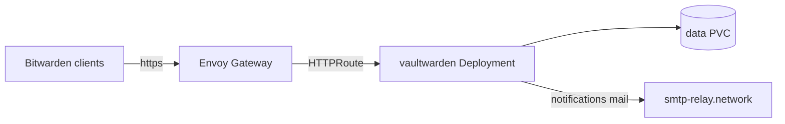

# vaultwarden

[Vaultwarden](https://github.com/dani-garcia/vaultwarden) is a Bitwarden-compatible password manager server. It stores the vaults used by browsers, mobile apps and the desktop clients.

**Namespace:** `selfhosted` · **Clusters:** `home`, `hcloud` - two fully independent instances with separate data and accounts. The `home` instance is LAN-only, the `hcloud` instance is reachable from the internet.

## Architecture

A single Deployment per cluster (app-template chart) with one container running the official Vaultwarden image against its embedded SQLite database on a PVC. There is no separate database or cache component.



## Dependencies

| Dependency | Type | Purpose |
| --- | --- | --- |
| smtp-relay (`network` namespace) | Mail relay | Invitation, verification and admin mails via `smtp-relay.network.svc.cluster.local` |
| kopiur backup component (`home` only) | Backup | Hourly PVC snapshots to the `kopiur-s3` repository |
| envoy-gateway (`network` namespace) | Ingress | HTTPRoute attachment |

## Access

| Cluster | Hostname | Gateway | Exposure |
| --- | --- | --- | --- |
| `home` | `vault.${INTERNAL_DOMAIN}` | `envoy-internal` | LAN only |
| `hcloud` | `vault.${EXTERNAL_DOMAIN}` | `envoy-external` | Public |

Authentication is Vaultwarden's own account login; signups and invitations are disabled in both instances (see [configuration](#configuration)). The admin page is protected by the `ADMIN_TOKEN` secret.

## Deployment

Each cluster has its own `ks.yaml` Flux Kustomization pointing at the `app/` directory, substituting cluster-wide variables from the `cluster-secrets` Secret. The HelmRelease uses the [app-template](https://github.com/bjw-s-labs/helm-charts) chart via a chart `OCIRepository`.

- home: [ks.yaml](https://code.offene.cloud/homelab/kops/src/branch/main/kubernetes/home/apps/selfhosted/vaultwarden/ks.yaml) additionally pulls in the `components/kopiur/backup` component (`APP: vaultwarden` plus `KOPIUR_*` overrides) and sets `prune: false` to protect the stateful resources.
- hcloud: [ks.yaml](https://code.offene.cloud/homelab/kops/src/branch/main/kubernetes/hcloud/apps/selfhosted/vaultwarden/ks.yaml) is a plain leaf Kustomization with `prune: true`.

## Configuration

Only the non-obvious settings (all in the HelmRelease `env` block, identical in both clusters unless noted):

- `SIGNUPS_ALLOWED: false` and `INVITATIONS_ALLOWED: false` - the instances are personal; accounts are created manually via the admin page.
- `ICON_SERVICE: internal` with `DISABLE_ICON_DOWNLOAD: true` and `ICON_CACHE_TTL: 0` - website icons are served from the internal icon service only and cached forever, so the server never fetches icons from third-party sites.
- `SMTP_*` - mail goes unauthenticated to the in-cluster relay `smtp-relay.network.svc.cluster.local:2525`, sender `no-reply@${MAIL_DOMAIN}`.
- `SSO_ENABLED: false` - OIDC login is prepared (secret keys and `SSO_*` settings exist) but deliberately disabled; see [decisions](#decisions).
- `EXPERIMENTAL_CLIENT_FEATURE_FLAGS: ssh-key-vault-item,ssh-agent` - enables storing SSH keys in the vault and the SSH agent feature in the clients.
- The pod runs as a non-root fixed UID with a read-only root filesystem; the `reloader.stakater.com/auto` annotation restarts it when the secret changes. The `home` instance runs as UID/GID 2000 (matching its kopiur mover), the `hcloud` instance as 1000.

### Admin token

The admin page (`/admin`) is enabled by the `ADMIN_TOKEN` key. Generate the token as an Argon2 hash inside a throwaway container and put it into the SOPS secret:

```bash
# Start a temporary vaultwarden container
kubectl run -it --rm temp --image=ghcr.io/dani-garcia/vaultwarden -- bash

# Create the password hash
/vaultwarden hash

# Copy the printed value into the app's secret.sops.yaml as:
#   ADMIN_TOKEN: '<generated argon2 hash>'
# (change the printed ADMIN_TOKEN='…' form into YAML "key: value" style)

# Exit the container with ctrl-d
```

## Secrets

The secret is injected via `envFrom` into the container.

| Secret | Source | Keys | Used for |
| --- | --- | --- | --- |
| `vaultwarden-secret` (home) | SOPS: [secrets.sops.yaml](https://code.offene.cloud/homelab/kops/src/branch/main/kubernetes/home/apps/selfhosted/vaultwarden/app/secrets.sops.yaml) | `ADMIN_TOKEN`, `SSO_CLIENT_ID`, `SSO_CLIENT_SECRET`, `SSO_AUTHORITY` | Admin page token; prepared OIDC client (unused while `SSO_ENABLED: false`) |
| `vaultwarden-secret` (hcloud) | SOPS: [secret.sops.yaml](https://code.offene.cloud/homelab/kops/src/branch/main/kubernetes/hcloud/apps/selfhosted/vaultwarden/app/secret.sops.yaml) | `ADMIN_TOKEN`, `SSO_CLIENT_ID`, `SSO_CLIENT_SECRET`, `SSO_AUTHORITY` | Same as home, for the hcloud instance |

## Storage

All state (SQLite database, attachments, icon cache) lives under `/data` on one PVC per instance:

| Cluster | Claim | Provenance | Backup |
| --- | --- | --- | --- |
| `home` | `vaultwarden` | Created by the `kopiur/backup` component | Hourly kopiur snapshots to the `kopiur-s3` `ClusterRepository`, restored automatically on a fresh PVC |
| `hcloud` | `vaultwarden-data-pvc` | Explicit [pvc.yaml](https://code.offene.cloud/homelab/kops/src/branch/main/kubernetes/hcloud/apps/selfhosted/vaultwarden/app/pvc.yaml) on `openebs-hostpath` | <!-- TODO: no in-cluster backup; document the Hetzner-level backup story --> |

## Troubleshooting

### Admin page returns unauthorized

**Symptoms:** `/admin` rejects the token after a secret change.

**Cause:** The `ADMIN_TOKEN` must be an Argon2 hash, not the plain password, and the pod must have restarted to pick up the new secret.

**Fix:** Regenerate the hash with `/vaultwarden hash` (see [admin token](#admin-token)), update the SOPS secret, and verify the pod restarted (the `reloader.stakater.com/auto` annotation should trigger it; otherwise delete the pod).

### Useful commands

```bash
kubectl -n selfhosted get pods -l app.kubernetes.io/name=vaultwarden
kubectl -n selfhosted logs deploy/vaultwarden -f
flux -n selfhosted reconcile helmrelease vaultwarden --with-source

# home instance: backup status
kubectl -n selfhosted get snapshotpolicy,snapshotschedule vaultwarden
```

## Decisions

Newest first.

### 2026-08-30 Move the home instance to a kopiur-managed PVC

**Status:** Accepted

**Context:** The `home` instance used a hand-written PVC (`vaultwarden-data-pvc`) that predated the kopiur backup system. The `kopiur/backup` component provisions its own PVC named `${APP}` and can only auto-restore into a claim it manages.

**Decision:** Migrate the data into a new PVC named `vaultwarden` provisioned by the `kopiur/backup` component, using a one-shot kopiur `Restore`, and drop the old claim.

**Consequences:** Backups and deploy-or-restore now work without manual wiring; `prune: false` protects the stateful objects. The `hcloud` instance still uses its explicit `vaultwarden-data-pvc` and has no in-cluster backup.

### 2026-06-02 Run independent instances per cluster

**Status:** Accepted

**Context:** The original instance in the `home` cluster is only reachable on the LAN, but vault access is also needed away from home.

**Decision:** Deploy a second, fully independent instance in the `hcloud` cluster behind `envoy-external` instead of exposing the home instance to the internet.

**Consequences:** The home vault stays off the internet. Accounts and data are not shared between the instances; vaults that need to be reachable externally must live in the hcloud instance.

### 2026-06-02 Prepare OIDC SSO but keep it disabled

**Status:** Accepted

**Context:** Vaultwarden's OIDC single sign-on support is still an experimental upstream feature.

**Decision:** Provision the SSO client credentials (`SSO_CLIENT_ID`, `SSO_CLIENT_SECRET`, `SSO_AUTHORITY`) and settings, but keep `SSO_ENABLED: false` until the feature is stable.

**Consequences:** Enabling SSO later is a one-line change; until then, login remains Vaultwarden's own account authentication. <!-- TODO: revisit when upstream SSO support stabilizes -->

## References

- Manifests (home): [kubernetes/home/apps/selfhosted/vaultwarden](https://code.offene.cloud/homelab/kops/src/branch/main/kubernetes/home/apps/selfhosted/vaultwarden)
- Manifests (hcloud): [kubernetes/hcloud/apps/selfhosted/vaultwarden](https://code.offene.cloud/homelab/kops/src/branch/main/kubernetes/hcloud/apps/selfhosted/vaultwarden)
- Upstream documentation: [Vaultwarden wiki](https://github.com/dani-garcia/vaultwarden/wiki)
